<div align="center">
  

<h1>Subnect+</h1>
  <p><i>pre-Alpha 0.1.0</i></p>

<p><b>Enhance Your Subnect Experience</b></p>

<p>
    <a href="docs/features.md">Features</a> •
    <a href="docs/development.md">Development</a> •
    <a href="docs/installation.md">Installation</a> •
    <a href="CONTRIBUTING.md">Contributing</a> •
    <a href="LICENSE">License</a>
  </p>

<p>
    <a href="https://github.com/nezumi0627/subnect-plus/blob/main/LICENSE">
      
    </a>
    &nbsp;
    <a href="https://deno.land">
      
    </a>
    &nbsp;
    <a href="https://www.typescriptlang.org/">
      
    </a>
  </p>
</div>

## 概要

Subnect+は、Subnectをより使いやすくするChrome拡張機能です。
設定の追加やUIの改善など、様々な機能拡張を提供します。

## 主な機能

- [設定ページ](docs/features.md#setting-button)の追加
- [ロゴデザイン](docs/features.md#change-logo-subnect)の刷新
- その他の機能改善

詳しい機能については[機能一覧](docs/features.md)を参照してください。

## クイックスタート

1. このリポジトリをクローン

```bash
git clone https://github.com/nezumi0627/subnect-plus.git
```

2. 依存関係をインストールしてビルド

```bash
deno cache src/content/main.ts
deno task build
```

詳しいインストール手順は[インストールガイド](docs/installation.md)を参照してください。

## バージョン情報

現在のバージョン: pre-Alpha 0.1.0

詳しいバージョン履歴は[バージョン履歴](docs/version-history.md)を参照してください。

## ライセンス

このプロジェクトは[MIT License](LICENSE)の下で公開されています。

## コントリビュータ


