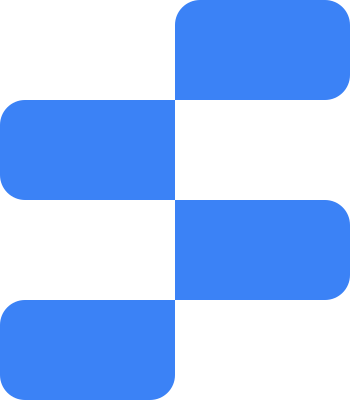

  <h1>Features</h1>
  
Subnect+の機能一覧

  <a href="#setting-button">Setting Button</a> •
  <a href="#change-logo">Change Logo</a>

 

  <h2>[2024/12/25] Setting Button</h2>
  
設定ページに拡張機能の設定を追加し、より使いやすいインターフェースを提供します。

<h3>実装内容</h3>
  <ul>
    <li>設定ページに拡張機能の設定を追加</li>
    <li>設定メニューからSubnect+の設定にアクセス可能</li>
  </ul>

    
  

 

  <h2>[2024/12/25] Change Logo Subnect+</h2>
  
ブランドの一貫性を保つため、ロゴデザインを刷新しました。

<h3>変更内容</h3>
  <ul>
    <li>Subnectのロゴを「Subnect+」に変更</li>
    <li>ロゴの色を青色に変更</li>
  </ul>

    
  

